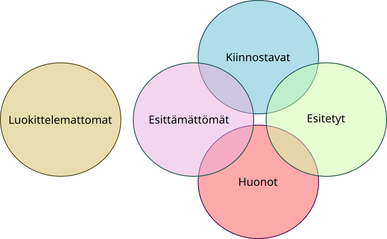

Tehtävien pistemäärät: 16 + 16 + 10 + 10 + 8 = 60

## Tehtävä 1

Tässä tehtävässä tarkastellaan metodeita `equals`- ja `clone`.
Osatehtävissä A ja B arvioidaan metodien valmista toteutusta,
ja kohdissa C ja D toteutetaan ko. metodit itse.

Tarkastele kirjaston kokoelmaan kuuluvia teoksia esittävää luokkaa
`Teoskappale`, joka löytyy tiedostosta `T1Selitettävät.java`. Vastaa
seuraaviin kysymyksiin:

**A)** Selitä rivi riviltä metodin `equals` toiminta. Arvioi erityisesti,
mihin `equals`-metodilta vaadittaviin ominaisuuksiin kukin rivi liittyy.
Arvioi jokaisesta rivistä myös, toimisiko metodi oikein, mikäli ko. rivin
jättäisi pois. Equals-metodilta vaadittavia ominaisuuksia ovat mm.
refleksiivisyys ja symmetrisyys (tarkempi lista
[luentomateriaalin Osassa 16 (Olioiden perusominaisuudet)](https://tech.utugit.fi/soft/tools/lectures/dtek0066/2022-fi1/lecture16/)).

**B)** Selitä metodin `clone` toiminta. Kerro erityisesti, millaisessa
suhteessa kopioitavan olion ja kopion viittaustyyppiset instanssimuuttujat
ovat toisiinsa nähden: viittaavatko ne samaan olioon vai erillisiin olioihin.
Pohdi myös, mitä merkitystä asialla on käytännössä. Pohdinnassa voit ajatella
vaihtoehtoista toteutusta, jossa kloonattaisiin ne ja vain ne oliot, jotka
annetussa toteutuksessa jätetään kloonaamatta.

**C)** Siirrytään sitten tarkastelemaan yhdistyksen jäsenrekisteriä, jonka toteutus
löytyy tiedostosta `Jäsenrekisteri.java`. `Jäsenrekisteri` koostuu `Jäsen`-olioista,
ja rekisterillä on lisäksi merkkijonomuodossa esitettävä nimi. Kahden
jäsenrekisterin katsotaan olevan keskenään samat, mikäli rekistereissä on
tarkalleen samat jäsenet. Jäsenten järjestyksellä jäsenrekistereissä ei ole
samuusvertailun kannalta merkitystä, kuten ei myöskään rekisterien nimillä.
Jäsenten tunnistamiseen käytetään henkilötunnusta - mikäli jostain syystä
olisi kaksi henkilöä, joilla on sama henkilötunnus mutta eri nimet,
nämä katsottaisiin samaksi henkilöksi.

Toteuta `Jäsenrekisteriin` edellä kuvatun mukainen `equals`-metodi.

**D)** Toteuta `Jäsenrekisteriin` metodi `clone`. Kloonauksen jälkeen rekisterien
tulee olla tietosisällöltään identtiset mutta toisistaan riippumattomat siinä
mielessä, että esim. kloonauksen jälkeen tehtävä jäsenen lisääminen alkuperäiseen
rekisteriin ei vaikuta kloonattuun rekisteriin. Yksittäisten jäsenten tietoihin
tehtävien muutosten (esim. nimen muuttuminen) sen sijaan on tarkoitus näkyä sekä
alkuperäisessä että kloonatussa jäsenrekisterissä.

### Pisteytys

* A-kohta: 4 pistettä
* B-kohta: 4 pistettä
* C-kohta: 4 pistettä
* D-kohta: 4 pistettä
* Yhteensä: 16 pistettä

---

## Tehtävä 2

Niilo Noviisi on kiinnostunut tietokoneohjelmien kirjoittamisesta, mutta
opiskeluun hän ei halua aikaansa käyttää. Niinpä hän on päätynyt toteuttamaan
kokoelmaluokan, jonka toiminnallisuus olisi löytynyt Javan standardikirjastoista. 

Niilo on huomannut käsittelevänsä usein listamuotoista dataa, joka koostuu
erilaisista luvuista. Niinpä hän on toteuttanut `Lukukokoelma`-luokan,
jonka alkiot ovat tyyppiä `Number`. Tärkeänä toiminnallisuutena listan koko
saadaan selville metodilla `koko()`, listan loppuun voidaan lisätä uusi
alkio metodilla `lisää(Number n)`, ja paikassa `i` oleva alkio saadaan
metodilla `hae(int i)`. 

Myöhemmin Niilo oivalsi, että usein kaikki hänen ohjelmansa käsittelemät
luvut ovat kokonaislukuja. Niinpä hän päätyi tekemään erillisen
`Kokonaislukukokoelma`-luokan, jonka hän toteutti perimällä
`Lukukokoelma`-luokan. Periytymisen seurauksena `lisää`-metodi ottaa
edelleen syötteeksi `Number`-tyyppisen olion, mutta alkuehtona ko.
olion vaaditaan olevan tyyppiä `Integer`. Luokkien toteutus löytyy
tiedostosta `Lukukokoelmat.java`.

Tehtäväsi on ensin kirjoittaa lyhyt ohjelmanpätkä, jonka avulla
voidaan havaita yo. kahden luokan kokonaisuuden olevan Liskovin
korvaavuusperiaatteen
([Liskov substitution principle](https://en.wikipedia.org/wiki/Liskov_substitution_principle))
vastainen ja arvioida sitten, miksi näin on. Toteutustehtävä:

**A)** Kirjoita (mieluiten mahdollisimman yksinkertainen) ohjelma, joka
toimii käytettäessä `Lukukokoelma`-luokan oliota mutta ei toimi oikein,
kun `Lukukokoelma`-olion tilalle vaihdetaan `Kokonaislukukokoelma`-olio.

Arvioi sitten, noudattavatko seuraavat tehtävät
[kurssin Osassa 17 (Tietotyypit ja varianssi)](https://tech.utugit.fi/soft/tools/lectures/dtek0066/2022-fi1/lecture17/) käsiteltyjä varianssisääntöjä:

**B)** lisää-metodi\
**C)** hae-metodi\
**D)** luokkainvariantit

Ota vastauksessasi metodien osalta huomioon sekä alku- ja loppuehdot
että mahdolliset palautettavien arvojen tyypit. 

Tehtävän on tarkoitus osaltaan selittää sitä, miksi Java-kielessä
geneeriset tyyppiparametrit luovat periytymishierarkiaan erillisiä
haaroja siinäkin tapauksessa, että joidenkin tyyppien välillä olisi
periytymissuhde. Tämän tehtävän tilanne vastaa karkeasti ottaen
kuvitteellista tilannetta, jossa `List<Integer>` olisi
`List<Number>`-tyypin alityyppi.

### Pisteytys

- 4 pistettä jokaisesta kohdasta, yhteensä 16 pistettä

---

## Tehtävä 3

**A)** Tarkastellaan seuraavaa rajapintamäärittelyä

```java
interface TietokantaKysely<X> {
    // @.post RESULT == (montako tietokannan riviä kysely tuotti tulokseksi)
    int rivimäärä();
    
    // @.post RESULT == (kyselyn tulosrivit taulukkona)
    Object[] rivit1();

    // @.post RESULT == (kyselyn tulosrivit taulukkona)
    X[] rivit2();
    
    // @.post RESULT == (kyselyn tulosrivit listana)
    List<X> rivit3();

    // @.post RESULT == rivit2()[riviNumero]
    X rivi(int riviNumero);
}
```

Mikä on symbolin X merkitys määrittelyssä - ts. mitä se edustaa
käsiteltävän datan kannalta? Mikä osa rajapintaa on geneeristä ja
miten geneerisyys siinä ilmenee? Millä tavoin rajapintamääritys
määrittää kyselyn tulosdatan muotoa tietorakenteena?

Vertaa lyhyesti metodeja `rivit1`, `rivit2`, `rivit3` ja `rivi`.
Miten metodit eroavat toisistaan ja minkä muotoista tietoa ne
palauttavat? (huom. metodi rivit on esitetty kolmella tavalla
lähinnä pedagogisista syistä -käytännössä luultavasti
valittaisiin jokin näistä kolmesta).

**B)** Ylioppilaiden elokuvakerho on päättänyt digitalisoida
katsomissuositusten tietokantansa, jota käytettäisiin kerhon
tulevan kauden esityskalenteria laadittaessa.

Tietokannan on tarkoitus pystyä luokittelemaan elokuvia joko
kiinnostaviksi tai huonoiksi (ei katsomisen arvoisiksi). Lisäksi
tietokanta pitää kirjaa luokittelemattomista ja elokuvailloissa
jo esitetyistä elokuvista.

Kaikki elokuvat luokitellaan ennen kuin ne voidaan ottaa ohjelmistoon
esitettäväksi ja sen jälkeen merkitä lopulta esitetyksi. Luokittelemattomien
listan tarkoitus on olla eräänlainen työjono, johon voi merkitä talteen
myöhempää luokittelua varten potentiaalisesti kiinnostavat uudet elokuvat.
Tietokannan alustavaan versioon ei kuitenkaan toteuteta vielä
esityskalenteria, pelkkä luokittelu.

Tietokanta siis koostuu seuraavista (elokuva)joukoista:

- **kiinnostavat**
- **huonot**
- **esitetyt**
- **luokittelemattomat**

Tietokanta halutaan kuvata geneerisesti luokaksi `Tietokanta` niin,
että elokuvien tarkkaa tyyppiä ei tarvitse tuntea. Voit käyttää
joukkojen määrittelyyn apuna Javan valmista luokkaa
[`HashSet`](https://docs.oracle.com/en/java/javase/18/docs/api/java.base/java/util/HashSet.html).
Elokuvista voidaan olettaa, että niille tullaan määrittelemään
`equals` ja `hashCode`, jotta metodi `contains` toimisi em. joukoilla.

Määritä luokan `Tietokanta` jäseniksi edellä kuvatut joukot. Muista
alustaa ne järkevällä tavalla (esim. tyhjiksi). Sovella lisäksi
polymorfismia niin, että tietojäsenet eivät paljasta luokan
sisällekään kaikkia toteutuksen yksityiskohtia, vaan jäsenet
riittää paljastaa
[`Set`](https://docs.oracle.com/en/java/javase/18/docs/api/java.base/java/util/Set.html)-tyyppisinä.

**C)** Tietokantaan ei haluttu tiedon duplikoitumisen välttämiseksi laatia
erillistä joukkoa elokuville, jotka on jo luokiteltu, mutta joita ei vielä
ole esitetty. Voidaan joukko-opillisesti päätellä, että nämä elokuvat
sisältyvät joko joukkoon `kiinnostavat` tai `huonot`, mutta eivät joukkoon
`esitetyt` (sisältyvyydet esitetty kuvassa graafisesti).



Toteuta kuvattu toiminnallisuus erillisenä metodina `esittämättömät()`
siten, että laskettu joukko saadaan paluuarvona. Voit luoda joukon
silmukoimalla läpi luokitellut, ohittamalla jo esitetyt ja lisäämällä
kriteerit täyttävät uuteen apujoukkoon. Voit myös vaihtoehtoisesti
yhdistää luokitellut yhdeksi joukoksi (huomioi sivuvaikutukset) ja
poistaa (`removeAll`) siitä jo esitetyt elokuvat.

### Pisteytys

* A-kohta: 4 pistettä
* B-kohta: 3 pistettä
* C-kohta: 3 pistettä
* Yhteensä: 10 pistettä

---

## Tehtävä 4

**A)** Oletetaan seuraavat määrittelyt luokille `Kissa`, `Koira` ja `Eläin`:

```java
abstract class Eläin {}
class Kissa extends Eläin {}
class Koira extends Eläin {}
```

Määritetään lisäksi seuraavat eläinlistat:

```java
ArrayList<Eläin> elukat = new ArrayList<Eläin>();
ArrayList<Kissa> kissat = new ArrayList<Kissa>();
ArrayList<Koira> koirat = new ArrayList<Koira>();
```

Selvitä Javan API-dokumentaatiota käyttäen tai kokeilemalla, voidaanko
listat `kissat` ja `koirat` lisätä listaan `elukat`
([`ArrayList.addAll`](https://docs.oracle.com/en/java/javase/18/docs/api/java.base/java/util/ArrayList.html)).
Perustele geneerisyyteen, varianssiin ja polymorfismiin
nojaten, miksi lisäys onnistuu / ei onnistuu. Miksi
listojen `kissat` ja `koirat` viittausta ei voida kuitenkaan
sijoittaa muuttujaan `elukat`? Miten määrittely tulisi
korjata, jotta sijoitus onnistuisi? Näytä ratkaisu
koodina ja selosta myös, miksi ratkaisu toimii.

**B)** Seuraava geneerinen metodi toteuttaa kahden listan yhdistämisen
edellä kuvattujen eläinluokkien kontekstissa:

```java
static <X extends Z, Y extends Z, Z extends Eläin> List<Z> yhdistä(List<X> xs, List<Y> ys){
  var tmp = new ArrayList<Z>();
  for (var x : xs) tmp.add(x);
  for (var y : ys) tmp.add(y);
  return tmp;
}
```

Hyödynnä luentomateriaalin [Osan 19 (Geneerisyys ja varianssi)](https://tech.utugit.fi/soft/tools/lectures/dtek0066/2022-fi1/lecture19/index.html)
graafia selittämään, mitkä kaikki tyyppisignatuurit ovat
yhteensopivia yhdistämisen tuloksena saadun listan kanssa.

**C)** Biologian laitoksen projekti on päätynyt kehittämään eläinten käyttäytymistä
mallintavaa simulaattoria. Ohjelman toiminnassa ideana on, että eläimiä
luokitella taksonien tapaiseen hierarkiaan (= ohjelman luokkahierarkia).
Lisäksi eläimillä on yhteisiä läpileikkaavia piirteitä, joita haluttaisiin
uudelleenkäyttää eri osissa hierarkiaa.

Toteutukseen sisältyvät seuraavat paketissa `tehtava4` kuvatut luokat ja rajapinnat:

- `Eläin`: kaikkien eläinten abstrakti kantaluokka, osaa tulostaa nimensä
- `Lentävä`: eläimet, jotka osaavat lentää
- `Uimataitoinen`: eläimet, jotka osaavat uida
- `Jalallinen`: eläimet, jotka osaavat kävellä
- `Nisäkäs`: eräs abstrakti eläintyyppi, ei tällä hetkellä tee mitään erityistä 
- `Kala`: eräs abstrakti eläintyyppi, joka osaa uida 
- `Vesisiippa`: konkreetti lepakkolaji, joka osaa uida, kävellä ja lentää
- `Liitokala`: konkreetti kalalaji, joka osaa uida ja lentää  

Laitos haluaa määrittää geneerisen eläimiin suoraan liittymättömän, (eettistä)
eläinkoetta kuvaavan rajapinnan `Operaatio`. Operaatiolla on kolme osaa
(metodia), joista ensimmäinen, `uita`, voidaan suorittaa
uimataitoisille eläimille (`Uimataitoinen`), toinen osa, `lennätä`, vastaavasti
lentäville eläimille (`Lentävä`) ja kolmas osa, `uitaJaLennätä`, vain niille
jotka hallitsevat molemmat toiminnot. Näistä viimeisen toteutus on oletusarvoisesti
`{ uita(); lennätä(); }`. Kahden ensin mainitun osan toteutusta ei voida antaa 
yleisesti.

Tarkastellaan esimerkkinä eläinkoetta `Operaatio_5_1_55`. Kokeessa uittaminen
uittaa eläintä 5 kertaa, lennätys lennättää kerran ja kolmas, yhdistävä
rutiini toimii muuten oletetusti, mutta suorittaa molemmat operaatiot viidesti. 

Auta laitosta määrittämään projektille rajapinta `Operaatio` sekä esimerkin
eläinkoe `Operaatio_5_1_55`. Demonstroi lopuksi ratkaisua ajamalla
kokeen osa `uitaJaLennätä` sekä `Liitokalalle` että `Vesisiipalle`. Molempien
olioiden pitäisi onnistua kokeesta, koska sekä liitokala että vesisiippa
osaavat uida ja lentää. Varmista tyyppien yhteensopivuus korvaavuusperiaatteen
mukaisesti. Selosta geneerisyyden ilmeneminen rajapinnan toiminnassa myös
sanallisesti, ei pelkästään koodina.

### Pisteytys

* A-kohta: 2 pistettä
* B-kohta: 2 pistettä
* C-kohta: rajapinnan määritys 2p, toiminnan selostus 2p, toiminnan demoaminen 2p, yht. 6 pistettä
* Yhteensä: 10 pistettä

---

## Tehtävä 5

Luokka `Säähavainto` kuvaa yksittäistä lämpötila- ja sadehavaintoa määrätyltä
paikalta määrättyyn aikaan. Luokalle on määritetty muodostin ja merkkijonoesitys.
Tutustuaksesi luokkaan paremmin, voit luoda keksittyjä säähavaintoja luokan
metodilla `keksi()` ja tulostaa näiden olioiden esityksiä terminaaliin.

**A)** Säähavainnot halutaan järjestää luonnollisesti (ensisijainen järjestämisen
peruste) aikaleimansa mukaan. Määritä luokalle sen luonnollinen järjestys.
Ota järjestyksen määrityksessä huomioon, että havaintoja voidaan mahdollisesti
haluta tarkentaa lisätiedoilla (esim. ilmanpaine), joita ei ole määritetty vielä
havainnon yhteyteen. Nosta tarvittaessa `ClassCastException`.

**B)** Säähavainnoille halutaan lisäksi tarjota toinen tapa järjestää ne niin,
että tämän toisen järjestyksen ensisijainen järjestysperuste on pituusaste ja
toissijainen leveysaste. Määritä asianmukaisesti myös tämä sijaintipohjainen
järjestys luokan yhteyteen.

**C)** Luo `keksi()`-metodilla kymmenen säähavaintoa listaksi. Demonstroi miten
kumpaakin järjestystä käyttäen voidaan lajitella havainnot. Tulosta kummatkin
lajitellut listat.

### Pisteytys

* A-kohta: 3 pistettä
* B-kohta: 3 pistettä
* C-kohta: 2 pistettä
* Yhteensä: 8 pistettä

